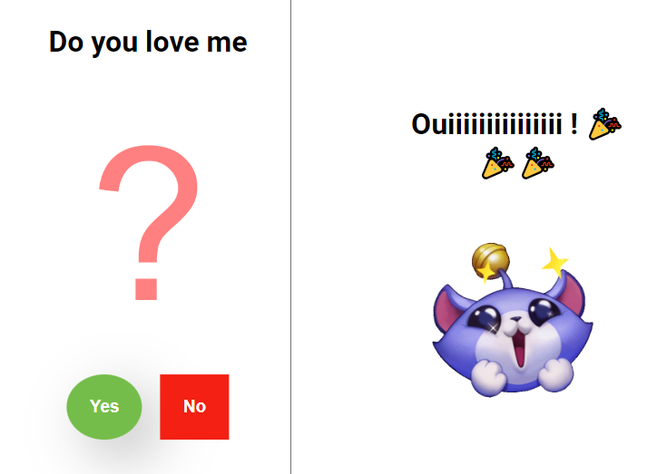
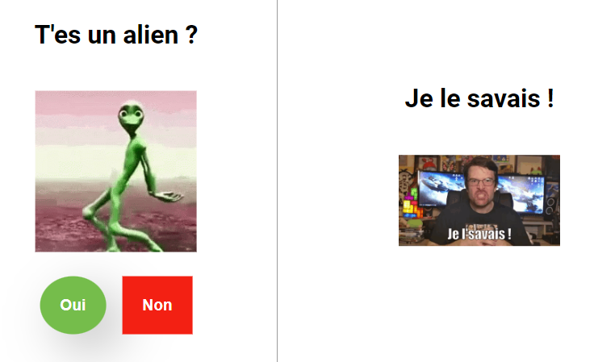

The purpose of the site is to troll friends by getting them to say No to a question.

## Utilisation
1. Enter url [https://lalbi94.github.io/CantSayNo/index.html](https://lalbi94.github.io/CantSayNo/index.html)

2. If you don't fill in the options, you'll get this : 

3. If you want to customize the page, here are the different options (index.html?msg=&img=&lang=&finish_txt&finish_gif):

| Argument   | Definition                                             |
|------------|--------------------------------------------------------|
| msg        | The question.                                          |
| img        | Image or Gif below the question.                       |
| lang       | Language (to change "yes" or "no") avalaible=[fr, en, es, zh, hi, ar, pt, bn, ru, ja, pa, de, ko, te, ta, ur, it, tl].                        |
| finish_txt | The text that will appear if the person clicks on yes. |
| finish_gif | Image or Gif below finish_txt.                         |

## Examples (not encoded url)
```
https://lalbi94.github.io/CantSayNo/index.html?msg=T'es un alien ?&img=https://i.pinimg.com/originals/2b/b8/78/2bb878f33afd34e139d592a2e37db1b2.gif&lang=fr&finish_txt=Je le savais !&finish_gif=https://media.tenor.com/06e290kCr_wAAAAM/jdg-joueur-du-grenier.gif
```


## Disclaimer
I've been lazy to do the code properly so there's no black list for words, be responsible and don't write weird stuff !